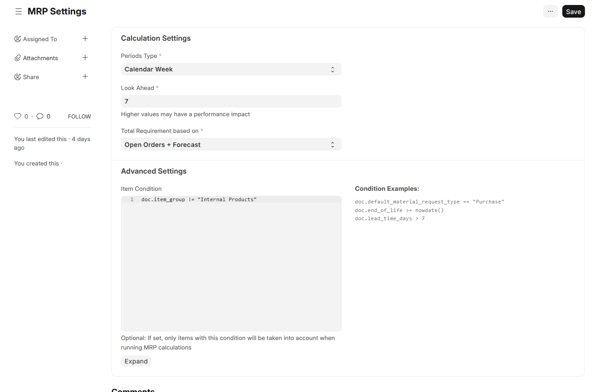

# MRP Calculations

The core of the MRP Tools is a background process that calculates the material plan. This process runs asynchronously and populates the `MRP Entry` table, which serves as the data source for the MRP Workbench. The calculation is designed to be idempotent, meaning it clears all previous data before generating the new plan to ensure accuracy.

### 1. MRP Settings

The `MRP Settings` doctype allows you to configure various parameters for the MRP calculation:

-   **Custom Item Lead Time Field**: This setting allows you to select an Item DocField to be used as the primary lead time (in days) for procurement or manufacturing. By default, this is `lead_time_days`.
-   **Item Additional Lead Time Field**: Optionally, you can select another Item DocField to add to the primary lead time. This is useful for incorporating custom lead time factors.
-   **Custom Purchase Order Item Delivery Date Field**: This setting allows you to select a mandatory Date DocField from the `Purchase Order Item` doctype. This field will be used as the delivery date for calculating `Ordered Qty` in the MRP run. By default, `schedule_date` is used.
-   **Custom Re-order Qty Item Field**: Here you can select another `Item` DocField to be used as the Re-order Quantity. Defaults to the 'Minimum Order Qty' field.
-   **Assume Remaining Quantity**: When calculating scheduled receipts from open Purchase Orders, this setting determines whether to include partially received order items. If enabled, the remaining unreceived quantity is considered as expected supply. If disabled, partially received items are ignored.

#### Variables/Measures Display Settings

The **Variables/Measures Display Settings** tab controls which planning metrics are visible as detail rows when you expand an item in the MRP Workbench. Each of the 13 available measures has a checkbox. Unchecking a measure hides its detail row from the workbench and removes it from the "Select a field" dropdown.

The following measures are **enabled by default**:

| Measure | Description |
| --- | --- |
| Projected On Hand (without Suggested Orders) | Projected inventory assuming no new orders are placed |
| Scheduled Receipts | Supply already confirmed via open Work Orders and Purchase Orders |
| Suggested Receipts | Quantity the MRP suggests should be received in each period |
| Projected On Hand (with Suggested Orders, excl Safety Stock) | Projected inventory including suggested orders, before safety stock buffer |
| Projected On Hand (with Suggested Orders, incl Safety Stock) | Projected inventory including suggested orders and safety stock |
| Open Sales/Work Orders | Firm demand from open Sales Orders and Work Orders |
| Total Forecast Demand | Demand from forecasts, including BOM-exploded upstream demand |
| Suggested Orders | Quantity to order, offset by lead time — the primary action field |
| Suggested Orders Value | Estimated cost of suggested orders |
| Suggested Orders Payable | Projected cash outflow for suggested (not-yet-placed) orders, based on supplier payment terms |
| Scheduled Receipts Value | Estimated value of open Purchase Order lines due in each period (base currency) |
| Scheduled Receipts Payable | Projected cash outflow for open Purchase Orders, distributed by supplier payment terms |
| Total Payable | Combined cash outflow: Scheduled Receipts Payable + Suggested Orders Payable |

The following measures are **disabled by default** (enable them for additional detail):

| Measure | Description |
| --- | --- |
| On Hand (without Suggested Orders) | Beginning-of-period stock, assuming no suggested orders |
| On Hand (with Suggested Orders, excl Safety Stock) | Beginning-of-period stock including the effect of suggested orders, excluding safety stock |
| On Hand (with Suggested Orders, incl Safety Stock) | Beginning-of-period stock including the effect of suggested orders and safety stock |

The calculation is executed in several distinct stages:

### 2. Item and Period Scaffolding

First, the system creates a planning scaffold for all relevant items over the defined time horizon.

- **BOM Level Calculation**: The process starts by calculating the Bill of Materials (BOM) level for every stock item. It uses a recursive SQL query to determine the deepest level an item appears in any default, active BOM. Top-level items are at level 0.
- **Time Horizon Generation**: Based on the "Look Ahead" setting in `MRP Settings`, the system generates a series of weekly periods (e.g., `2026-W40`, `2026-W41`, etc.).
- **MRP Entry Creation**: An `MRP Entry` record is created for each item for each week in the look-ahead period. This creates the grid of data that will be populated in the subsequent steps.

### 3. Raw Signal Population

Next, the system populates the raw input signals for every item and period in a series of set-based SQL passes. No calculations are performed yet — these are just data loads:

- **Reserved Qty**: Demand from open Sales Orders, grouped by delivery week.
- **Reserved Qty for Production**: Material requirements from open Work Orders, grouped by planned start week.
- **Forecast Demand**: Demand from the `MRP Forecast` doctype, grouped by forecast week.
- **Planned Qty**: Expected supply from open Work Orders (manufactured items), grouped by planned start week.
- **Ordered Qty** and **Scheduled Receipts Value**: Expected supply and committed spend from open Purchase Orders, grouped by delivery week. The delivery date field and partial-receipt handling are controlled by the `Purchase Order Item Delivery Date Field` and `Assume Remaining Quantity` settings in `MRP Settings`.

### 4. Level-by-Level Net Explosion

This is the core of the calculation. The system iterates through each BOM level in order (level 0 first, then 1, 2, and so on). At each level, three steps run in sequence:

**Step 1 — Roll up totals**

The raw signals are summed into planning totals for all items at the current level:
- `Open Orders` = Reserved Qty + Reserved Qty for Production + Upstream Net Demand
- `Total Forecast Demand` = Forecast Demand
- `Scheduled Receipts` = Planned Qty + Ordered Qty

**Step 2 — Calculate Suggested Receipts**

For each item at this level, the system calculates how much needs to be produced or purchased, period by period, in chronological order:

1. **Beginning Inventory**: `On Hand Inventory` for the first period is the current actual stock level, excluding any warehouses marked as **Rejected Warehouses** (`is_rejected_warehouse = 1`). For subsequent periods it is the `Projected On Hand Inventory` from the previous period.
2. **Net Requirements**: Total demand is determined by the "Requirement based on" setting (e.g., Forecast only, Open Orders + Forecast, etc.).
3. **Shortage**: `shortage = on_hand_inventory + scheduled_receipts − demand − safety_stock`
4. **Suggested Receipts**: If shortage < 0, the system orders enough to cover it, rounded up to the item's `Min Order Qty`. If stock and scheduled receipts are sufficient, `Suggested Receipts = 0` — no production is needed.
5. **Projected Inventory**: `on_hand_inventory − demand + scheduled_receipts + suggested_receipts`

**Step 3 — Net demand explosion (all levels except the last)**

Once `Suggested Receipts` is known for the current level, that quantity is exploded down to child components:

- For each manufactured item at this level where `suggested_receipts > 0`, the system multiplies by each BOM component's quantity ratio and writes the result into the child item's `Upstream Net Demand` field.
- The demand is dated by shifting the parent's `target_date` backward by the parent's combined lead time (primary + additional). If this shifted date falls before today, it snaps forward to the current week.
- Demand from multiple parents is **accumulated** (additive), not overwritten.
- Because the explosion is anchored on `suggested_receipts` — not on raw demand — children only receive upstream demand when the parent genuinely needs to be produced. If the parent's stock already covers its demand, `suggested_receipts = 0` and no demand propagates to children.

> **"Forecast only" mode note**: Under this mode, `Upstream Net Demand` still flows into `Open Orders` (step 1), but `Open Orders` is ignored when computing demand in step 2 (only `Total Forecast Demand` is used). A child component with no direct forecast therefore receives zero `Suggested Receipts`, even if its parent has a production need. Use "Open Orders + Forecast" if you want upstream production demand to drive component ordering.

### 5. Finalisation

After all levels have been processed, the system computes the output and action fields:

- **Suggested Orders**: Each `Suggested Receipt` is offset backward by the item's lead time to place a `Suggested Order` in the correct earlier period. For example, a suggested receipt in Week 42 for an item with a 2-week lead time generates a suggested order in Week 40.
- **Days to Reorder**: Calculated for the header period (week 0) only. The system finds the first period with a suggested receipt, works backward by the item's lead time, and computes how many days remain. A positive value means there is still time to act; a negative value means the order is already late. If no shortage is projected across the entire horizon, this field shows `—` to clearly distinguish "no action needed" from `0` (order today). Two variants are calculated: one including the safety stock floor and one excluding it.
- **Cash Requirements**: Finally, the system projects the financial impact of the plan across three fields.
    - **Suggested Orders Value**: Calculates the estimated cost of the `Suggested Orders` using a three-step price lookup:
        1. **Supplier-specific price** — an `Item Price` record where `supplier` matches the item's default supplier, in the currency of the configured buying price list, with a valid date range.
        2. **Buying price list** — if no supplier-specific price exists, the most recently valid `Item Price` on the price list configured in **Buying Settings → Buying Price List**, filtered to the correct currency and date range.
        3. **Valuation rate fallback** — if no `Item Price` is found, the item's average bin valuation rate is used, falling back to `Item.valuation_rate`.
        Prices in a UoM other than the item's stock UoM are automatically converted using the item's UoM conversion table (or the global UOM Conversion Factor table).
    - **Suggested Orders Payable**: Projects the cash outflow for not-yet-placed orders based on the default Supplier's **Payment Terms**. The due date is calculated relative to the week in which the order would be placed.
    - **Scheduled Receipts Value**: Calculates the base-currency value of open Purchase Order lines due in each period, using `(remaining qty × base_rate)` from each PO line. This reflects committed spend already on order.
    - **Scheduled Receipts Payable**: Projects the cash outflow for open Purchase Orders by processing each PO line individually using its actual dates. The base date for each payment term type is taken directly from the PO:
        - **Order date**: uses `po.transaction_date` (the actual date the PO was placed).
        - **Shipment date**: uses `po_item.schedule_date` (the actual ETD on the PO line).
        - **Arrival date**: uses `po_item.custom_expected_arrival_date` (the actual ETA on the PO line), falling back to `schedule_date` if absent.
    - **Total Payable**: The sum of `Scheduled Receipts Payable` and `Suggested Orders Payable` — the complete projected cash requirement for the period.
    - **Custom Due Dates**: The system supports dynamic due dates on the `Payment Term` doctype. This allows you to split payments based on milestones:
        - **Order date**: The payment for suggested orders is calculated relative to when the order is placed; for open POs, the actual `transaction_date` is used.
        - **Shipment date**: The payment for suggested orders is calculated relative to the order date + primary lead time; for open POs, the actual `schedule_date` (ETD) is used.
        - **Arrival date**: The payment for suggested orders is calculated relative to the order date + total lead time; for open POs, the actual `custom_expected_arrival_date` (ETA) is used.
        - If no custom due date is set on the payment term, the system defaults to the posting date of the document.
    - If no supplier or payment terms are configured for an item, all payable amounts default to the same period as the order or delivery.

## MRP Entry Fields

The following are the key fields calculated for each item in each period:

| Field                           | Description                                                                                                                                                           |
| ------------------------------- | --------------------------------------------------------------------------------------------------------------------------------------------------------------------- |
| **Item Details**                |                                                                                                                                                                       |
| `item_code`                     | The item being planned.                                                                                                                                               |
| `bom_level`                     | The calculated BOM level of the item.                                                                                                                                 |
| `target_date`                   | The target date for the planning period (week).                                                                                                                       |
| `reorder_level`                 | The minimum stock level for the item, from the `Safety Stock` field on the Item master.                                                                               |
| `reorder_quantity`              | The minimum order quantity (MOQ) for the item, from the `Min Order Qty` field on the Item master.                                                                     |
| `lead_time`                     | The lead time (in days) for procuring or manufacturing the item, derived from the 'Item Lead Time Field' and 'Item Additional Lead Time Field' in MRP Settings.       |
| **Inventory & Demand**          |                                                                                                                                                                       |
| `on_hand_inventory`             | The stock on hand at the beginning of the period. Stock in warehouses marked as Rejected Warehouses (`is_rejected_warehouse = 1`) is excluded.                        |
| `open_orders`                   | Total firm demand for the period: Reserved Qty (Sales Orders) + Reserved Qty for Production (Work Orders) + Upstream Net Demand. |
| `upstream_net_demand`           | Net demand exploded from parent items at the level above. Written when a parent's `suggested_receipts > 0` and this item appears in the parent's BOM. Accumulated additively from all parents. |
| `total_forecast_demand`         | Total demand from MRP Forecasts for this item and period.                                                                        |
| **Supply**                      |                                                                                                                                                                       |
| `scheduled_receipts`            | Total expected supply from open Work Orders and Purchase Orders.                                                                                                      |
| **Calculations & Projections**  |                                                                                                                                                                       |
| `suggested_receipts`            | The quantity the MRP calculation suggests should be received in this period to avoid a shortage.                                                                      |
| `suggested_orders`              | The quantity that should be ordered, offset by lead time. This is the primary action field.                                                                           |
| `projected_on_hand_inventory`   | The projected stock on hand at the end of the period after considering all demand, supply, and suggested receipts.                                                    |
| `suggested_orders_value`        | The estimated value of the suggested orders.                                                                                                                          |
| `suggested_orders_value_payable`| Projected cash outflow for not-yet-placed orders, distributed by the supplier's payment terms.                                                                        |
| `scheduled_receipts_value`      | Base-currency value of open Purchase Order lines due in this period: `SUM((qty − received_qty) × base_rate)`.                                                         |
| `scheduled_receipts_value_payable` | Projected cash outflow for open Purchase Orders, distributed by the supplier's payment terms using the actual PO dates (`transaction_date`, `schedule_date`, or `custom_expected_arrival_date`) per payment term type.                                     |
| `total_payable`                 | Combined projected cash outflow: `scheduled_receipts_value_payable + suggested_orders_value_payable`.                                                                 |
| **Urgency Indicators** (header period only) | |
| `days_to_reorder`               | Days until the order must be placed, accounting for lead time and safety stock. Negative = already late. Blank (`—`) when no shortage is projected across the entire horizon. |
| `days_to_reorder_excl_reorder_level` | Same as above, but calculated without the safety stock floor. Blank (`—`) when no true shortage (excluding safety stock) is projected. |
| `needs_reorder`                 | Internal flag (`1`/`0`) set to `1` when a genuine shortage including safety stock was found. Used by the workbench to distinguish "order today" (`0` days) from "no action needed" (`—`). |
| `needs_reorder_excl_reorder_level` | Same as above, but for the safety-stock-excluded calculation. |