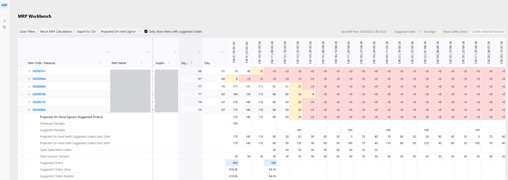

# MRP Workbench

The MRP Workbench is the primary user interface for viewing and interacting with the material requirements plan. It provides a dynamic, grid-based view of your MRP data, allowing planners to quickly identify potential issues and take action.

### Layout and Structure

The workbench displays the MRP data in a pivoted grid:

-   **Rows**: Each primary row represents a single stock item. You can expand these item rows to reveal detail rows, which break down the calculation for each specific metric (e.g., `On Hand Inventory`, `Open Sales/Work Orders`, `Suggested Receipts`) across the time horizon. The set of metrics shown in these detail rows is configurable — see **Variables/Measures Display Settings** in [MRP Settings](erpnext_mrp_run.md#mrp-settings).
-   **Columns**: The columns are structured to show both static item information and time-phased planning data.
    -   **Static Columns**: The initial columns display key item details like `Item Code`, `Item Name`, `Item Group`, `UoM`, `BOM`, `Lvl`, `Safety Stock`, `Re-order Qty`, `Lead Time`, `Supplier`, `Days to Reorder (incl Safety)`, and `Days to Reorder`. The two **Days to Reorder** columns show how many days remain before an order must be placed (negative = already late, `0` = order today). They display `—` when no shortage is projected across the entire planning horizon, meaning the item's current stock and open purchase/work orders fully cover all demand — no action is required.
    -   **Dynamic Weekly Columns**: The subsequent columns represent the weekly time buckets of the planning horizon (e.g., `2026-W40`, `2026-W41`). For the primary item rows, these columns display a single key figure determined by the field selector. For the expanded detail rows, they show the value for that specific metric.

### Key Features and Actions

The workbench includes several features to help you analyze and manage your material plan:

-   **Clear Filters**: Action to reset the grid's filters.
-   **Rerun MRP Calculations**: This action triggers a background job to recalculate the entire material requirements plan. A dialog will appear to confirm that the process has started and will provide a link to monitor the background job's progress. Once the calculation is complete, you can reload the page to see the updated plan.
-   **Insufficient Forecast Warning**: When the workbench loads, it automatically checks whether `MRP Forecast` data covers the full look-ahead window configured in MRP Settings. If the latest forecast record falls before the end of the look-ahead period, a warning dialog is shown indicating how many weeks are uncovered and linking directly to the MRP Forecast list so you can extend your data. The warning is informational only and can be dismissed without affecting any other functionality. It will reappear on the next page load until the forecast data is extended. This check is skipped automatically when the **Requirement Based On** setting is `Open Orders only`, since forecast data has no effect on the plan in that mode.
-   **Export to CSV**: Export the current view of the MRP grid to a CSV file for offline analysis or reporting.
- **Column Field Selector**: A dropdown menu at the top allows you to choose which data field is displayed in the weekly columns for the primary item rows. This is useful for quickly scanning key metrics like `Suggested Orders`, `Projected On Hand Inventory`, or `Suggested Orders Value Payable` across the timeline without needing to expand the rows.
-   **Column Filters**: The text columns `Item Code`, `Item Name`, `Item Group`, `BOM`, and `Supplier` each have a filter popover, opened by clicking the funnel icon in the column header. Each popover contains two inputs:
    -   **Include (contains)**: Shows only rows where the column value contains the entered term (SQL `LIKE`).
    -   **Exclude (not contains)**: Hides rows where the column value contains the entered term (SQL `NOT LIKE`).

    Both inputs can be used together — only rows satisfying both conditions are shown. Press **Enter** in either input or click **Search** to apply; click **Clear** to reset both inputs for that column. The funnel icon turns blue whenever either input is active. When an exclude filter is active, a small `✕ excl` tag appears in the column header as an additional visual reminder.

-   **Visual Cues**: The grid uses color coding and icons to draw attention to important items:
    -   Red Highlight: Indicates a **P1 - Critical** urgent item. This means the item is required and there is not enough quantity on order.
    -   Orange Highlight: Indicates a **P2 - Attention** urgent item. This means there is enough quantity on order, but it's scheduled to arrive late.
    -   **P3 - Optional** urgent items (ordered but stock will be below safety stock) do not have a specific row highlight but are indicated by the `Urgency Level` column.
    -   Blue Highlight: Indicates a cell with a **Suggested Order** greater than zero, highlighting the need to place a purchase or work order.
    -   **⚠ Out-of-Sync Indicator**: A warning icon shown next to an item code when the item's current stock level (live `tabBin` data) differs from the stock level recorded at the time of the last MRP run. Hover over the icon to see a tooltip with the stored value, the current value, and the signed delta (e.g. `Stock changed since last MRP run: was 100, now 85 (-15.00)`). The indicator clears automatically after the next MRP run completes and the workbench reloads. Items that have never been stocked (no warehouse bins) will not show the indicator.
-   **Create Material Request**: This is the primary action on the workbench.
    1.  **Select Rows**: Use the checkboxes to select one or more item rows that have suggested orders.
    2.  **Click Button**: Click the "Create Material Request" button.
    3.  **Confirm**: A dialog box appears summarizing the items, quantities, and suppliers for the material requests that will be created.
    4.  **Creation**: Upon confirmation, the system automatically creates Purchase-type Material Requests. The items are intelligently grouped into separate Material Requests based on their `Default Supplier`. If no supplier is specified, items are grouped into a single request.
    5.  **Success Notification**: A final dialog shows the names of the newly created Material Requests, with links to navigate directly to them.